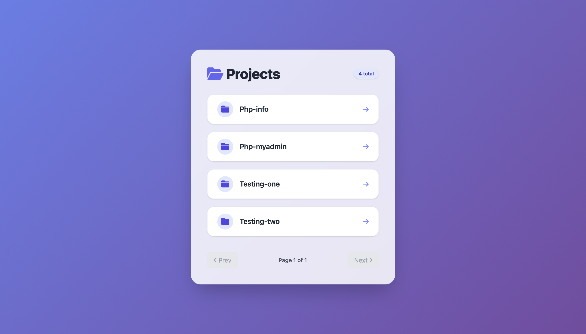

## Getting Started



Clone the repository:

```bash
git clone https://github.com/snlt11/xampp-docker
```

Docker Build and Run

```bash
docker compose up -d --build
```

Docker Down

```bash
docker compose down
```

UI

```bash
http://127.0.0.1:7001/
```

phpMyAdmin

```bash
http://localhost:7002/
```

```bash
username - root
password - root
```
